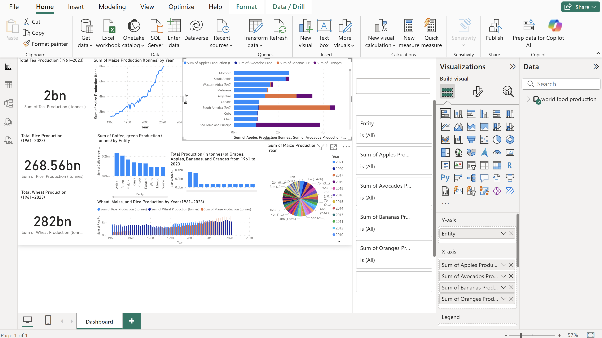

# 🌍 World Food Production Dashboard (1961–2023)

This repository contains a Power BI dashboard that visualizes global food production data from 1961 to 2023.

## 📊 Dashboard Highlights

- 📈 Year-wise trends of Maize, Rice, and Wheat production
- 🌎 Country-wise production of Apples, Bananas, Avocados, and Oranges
- 📌 Total production summaries for Tea, Coffee, and Grapes
- 📅 Pie chart and bar chart insights grouped by year and entity

## 🗂️ Files Included

| File Name                           | Description |
|------------------------------------|-------------|
| `World_Food_Production_Dashboard.pbix` | Power BI dashboard file |
| `world_food_production.csv`    | Cleaned dataset used in Power BI |
| `Screenshot.png`                   | Dashboard preview image |

## 📥 Dataset Source

Original dataset from Kaggle:  
🔗 [World Food Production – Kaggle](https://www.kaggle.com/datasets/rafsunahmad/world-food-production)

## 🛠 Tools Used

- Power BI Desktop
- DAX (for calculated fields)
- CSV/Excel preprocessing

## 📸 Dashboard Preview

---

📌 Feel free to fork this repo or use it as inspiration for your own Power BI projects!
